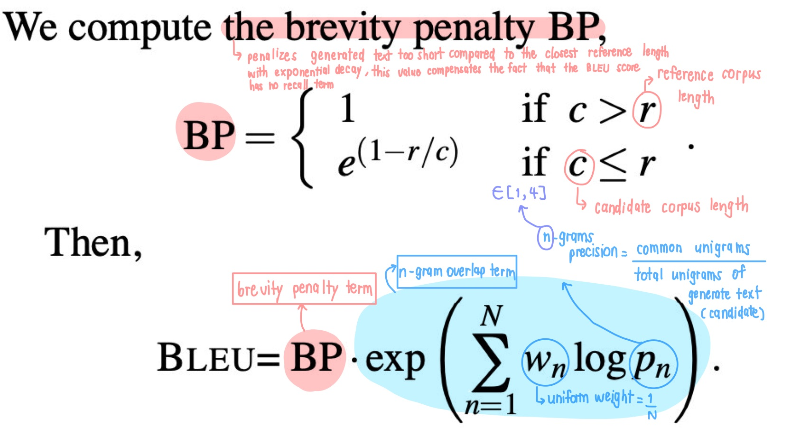

# Evaluation Metrics
From my research about text evaluation metric, I would like to catagorize them into two main group as following below:

## Traditional 

  BLEU

 
  
**BLEU** 
 stands for **B**i**L**ingual **E**valuation **U**nderstudy
- measures the similarity of the machine-translated text to a set of high quality reference
- score is in the range of [0,1], 1.0 = perfect score
- formula

  

- example of calculatioon
- tradeoffs
- code for implementation

  ROGUE

  METOER

## Non-traditional 

- ### **Embbeding based**

  BERTScore

 Moverscore

 - ### **LLM assisted**

 MTbench

Chatbot Arena

## Reference 
- [BLEU: a Method for Automatic Evaluation of Machine Translation](https://aclanthology.org/P02-1040.pdf)
