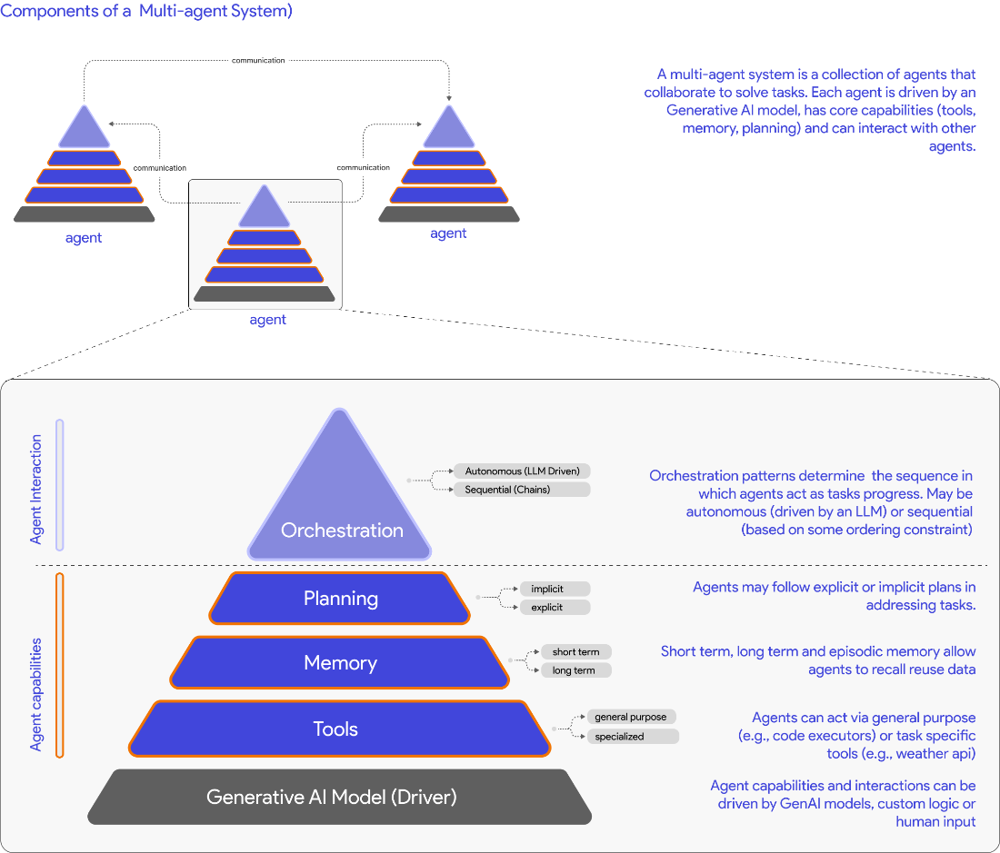
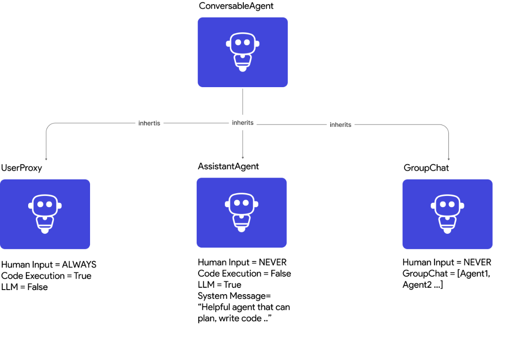

## My Lecture about Agentic Workflow with LLMs

<details> <br> <summary> Multi-Agent Systems with AutoGen </summary>


Below is my summarization of **Dibia, Victor, and Chi Wang. *Multi-Agent Systems with AutoGen*. Manning Publications, 2024. https://www.manning.com/books/multi-agent-systems-with-autogen.**

<details><summary>
1. Understanding a Multi-Agent System (MAS)</summary>

## Multi-Agent system
- **agent:** entities that can reason, act, communicate and adapt to solve problems
- **A multi-agent system:** group of agents collaborating to solve tasks, each agent has their own abilities (reasoning, acting, communicating, adapting)
- **multi agent system has two core components** which can be driven by a combination of generative AI models, tools, and human input:
  - **agent capabilities:** method by which agents address tasks
    - mechanisms for **reasoning** (planning, deducing, etc. by applying some rules or logic), reasoning can be deductive, inductive, abductive
    - mechanisms for **acting** (utilizing tools)
    - mechanisms for **adapting** (learning, recalling information from memory), adjust their actions, and plans based on changing conditions, new information, or feedback from other agents and humans
  - **agent interactions:** how agents communicate and collaborate to solve tasks
    -  **agent workflows** (how agents are organized or grouped to address tasks, includes properties such as the entry point (how the task is initiated), details for each agent (tools, memory, models), conditions for task success or termination, and the orchestration pattern, workflow can be defined by developer or can be driven by some logic or LLMs )
    -  **agent orchestration** (the sequence in which agents take action as the task progresses, can be deterministic sequence, or sequence that involves agents reasoning over the task state)



> Picture Reference: *Dibia, Victor, and Chi Wang. *Multi-Agent Systems with AutoGen*. Manning Publications, 2024.*

## Autogen core feature
- **autogen core feature** provides us
  - **ConversableAgent:** class with methods  1) for sending and receiving messages between agents and  2) for defining how an agent acts on a received message, it includes a set of built-in agent classes
    - **UserProxyAgent**: has default capabilities to execute code and solicit human input
    - **AssistantAgent**: configured to address tasks using an LLM
    - **GroupChatManager** : serves as a container abstraction for enabling interactions between groups of agents


> Picture Reference: *Dibia, Victor, and Chi Wang. *Multi-Agent Systems with AutoGen*. Manning Publications, 2024.*

## Basic Example

a setup where two agents converse to solve the task Generate a plot of the stock price of NVIDIA for the last 30 days:

```py
# define LLMs config
llm_config = {"config_list": [{ "model": "gpt-4-turbo-preview"}]}

# (I)
assistant = AssistantAgent(
    name= "assistant", llm_config=llm_config)

# (II)
user_proxy = UserProxyAgent(
    name = "user_proxy",
    code_execution_config={"work_dir": "scratch",
                           "use_docker": True},
    human_input_mode="NEVER",
    is_termination_msg=lambda x: x.get("content", "").rstrip().endswith("TERMINATE")
    )

# (III)
user_proxy.initiate_chat(assistant, message="Plot a chart of NVDA and TESLA stock price change YTD. Save the result to a file named
 chart.png.")

```
- (I) defines an assistant agent which inherits the default system message for an AutoGen assistant agent and has access to an LLM via the specified llm_config parameter
- (II) defines a user proxy agent, which is configured with code writing capabilities (by providing a code_execution_config). Any code generated is written to the specified #directory work_dir and executed in a Docker container. We also define a task termination condition where the task ends when the user_proxy receives a message that #ends with the string TERMINATE
- (III) The user_proxy sends a message to the assistant agent to start the task. The assistant agent then responds with a plan to address the task, code snippets to execute, and any other relevant information. Given that the user_proxy has code execution capabilities, it can execute the code snippets provided by the assistant agent to address the task and share the results back with the assistant agent
</details>

<details><summary>
2. Building your first multi-agent application
</summary>

## Defining agents in code

- `ConversableAgent` class, list of important parameters for the ConversableAgent class are listed below:

    - `system_message`: System message useful for core agent behaviors
    - `is_termination_msg`: Function to determine if a message terminates the conversation
    - `max_consecutive_auto_reply`: Maximum consecutive auto replies
    - `human_input_mode`: Determines when to request human input (e.g., always, never, or just before a task terminates)
    - `function_map`: Mapping names to callable functions. This wraps the OpenAI tool calling functionality
    - `code_execution_config`: Configuration for code execution
    - `llm_config`: Configuration for LLM-based auto replies
 
- `UserProxyAgent`
  - `human_input_mode` set to `ALWAYS`
  - `llm_config` set to `False`
- `AssistantAgent`
  - `human_input_mode` is set by default to `NEVER`
- `GroupChat`
  - An abstraction to enable groups of ConversableAgents to collaborate on a task, with some plumbing to orchestrate their interactions (e.g., determining which agent speaks/acts next), maximum rounds in a conversation, etc.
  - GroupChat is wrapped by a GroupChatManager object which inherits from the ConversableAgent class
  - GroupChat abstraction receives a message, it broadcasts it to all agents, selects the next speaker based on the group chat orchestration policy, enables a turn for the selected speaker, checks for termination conditions, and continues this process until a termination condition is met


## Granting agents access to tools

## Implementing short and long term memory in agents

## Exploring strategies for task termination

## Orchestrating groups of agents to address tasks


</details>

</details>

